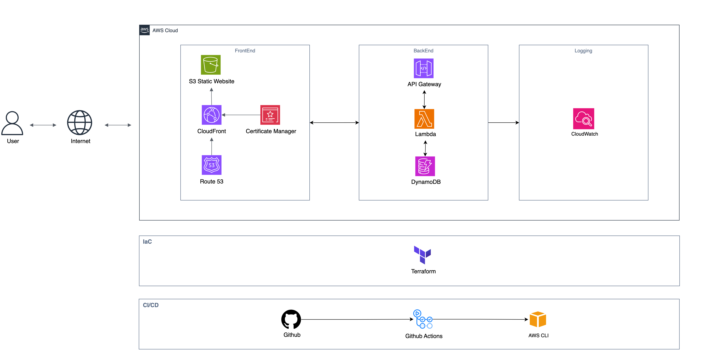

# Cloud Resume

This project showcases the use of some AWS services to deploy a resume website.
So far, it integrates S3, Route 53, ACM, CloudFront and Terraform.

It is still a work in progress.

## Features

- **Static Website Hosting:** Hosted in an S3 bucket using the Static Website Hosting feature
- **Custom Domain:** Uses Route 53  for managing domain names and records
- **Infrastructure as Code:** Manages the AWS resources programmatically

## Architecture

So far, the architecture looks like this:

## Future Improvements

- [x]  Add a visitor counter to the site
- [x]  Implement a CI/CD pipeline to enhance the development process
- [ ]  Add a weakly/monthly visit counter
